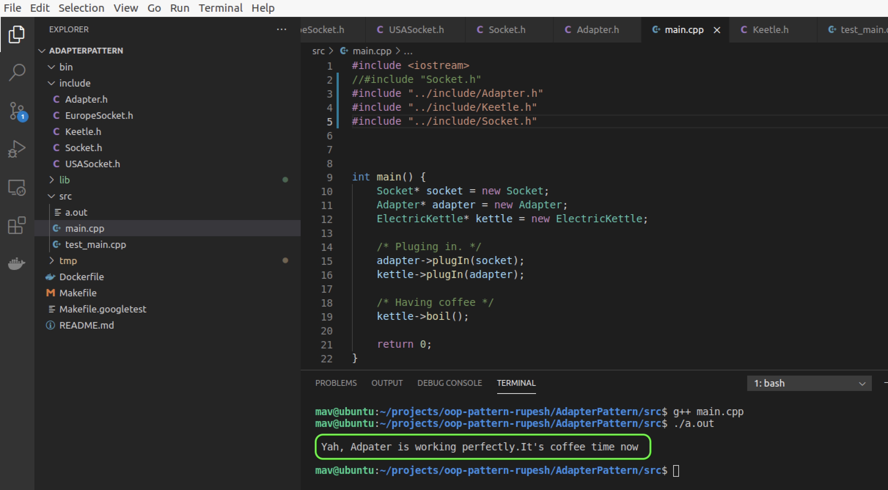

## OOP-Assignment for pattern designing

## Adapter Pattern Design

## Who
```
 Owner 1: Rupesh Panta 
 Owner 2: Mario Bravo
```
## Clean-Build-Test Screen Capture




# Sources
https://en.wikipedia.org/wiki/Adapter_pattern

https://www.giacomodebidda.com/adapter-pattern-in-python/


## Build

```bash
make clean
make all
```

## Test

```bash
bin/test_hello
```

## Run

```bash
bin/hello
```


