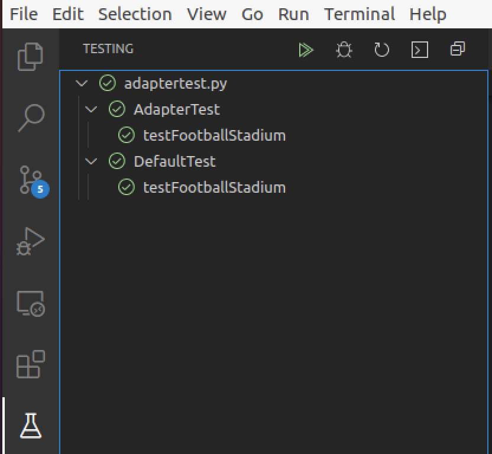
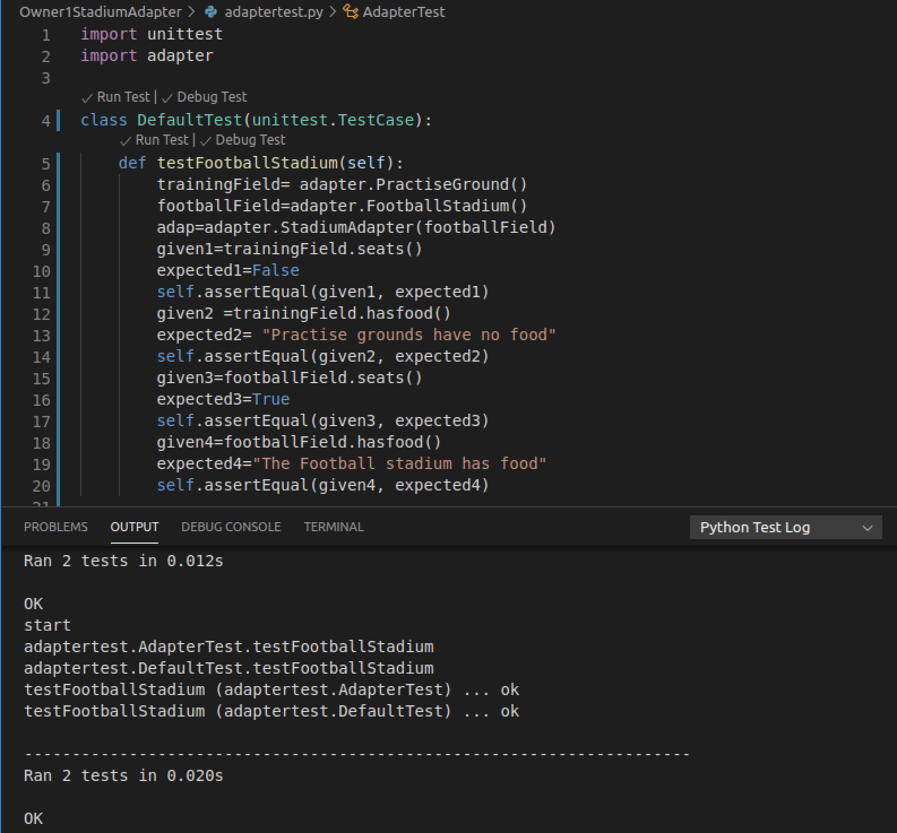
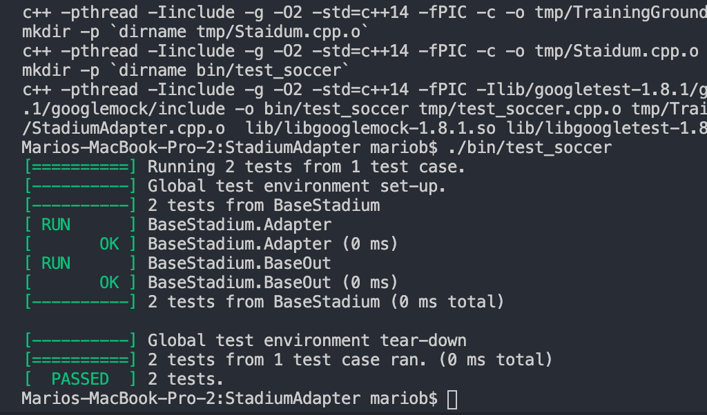

# oop-pattern-design Assignment: Adapter Pattern

## Team
- [x] Rupesh Panta -Owner 1
- [x] Mario Bravo - Owner 2


## Proggramming Languagges
- [x] Python - Rupesh did it in python
- [x] C++ -Mario converted the code into C++


# Note:
```
    Please check Owner1StadiumAdapter folder for owner1 code and StadiumAdapter folder for owner2 code.
```
# Python Testing Screenshot




# C++ Testing Screenshot



# Sources
https://en.wikipedia.org/wiki/Adapter_pattern

https://www.geeksforgeeks.org/adapter-pattern/

https://www.tutorialspoint.com/python_design_patterns/python_design_patterns_adapter.html


