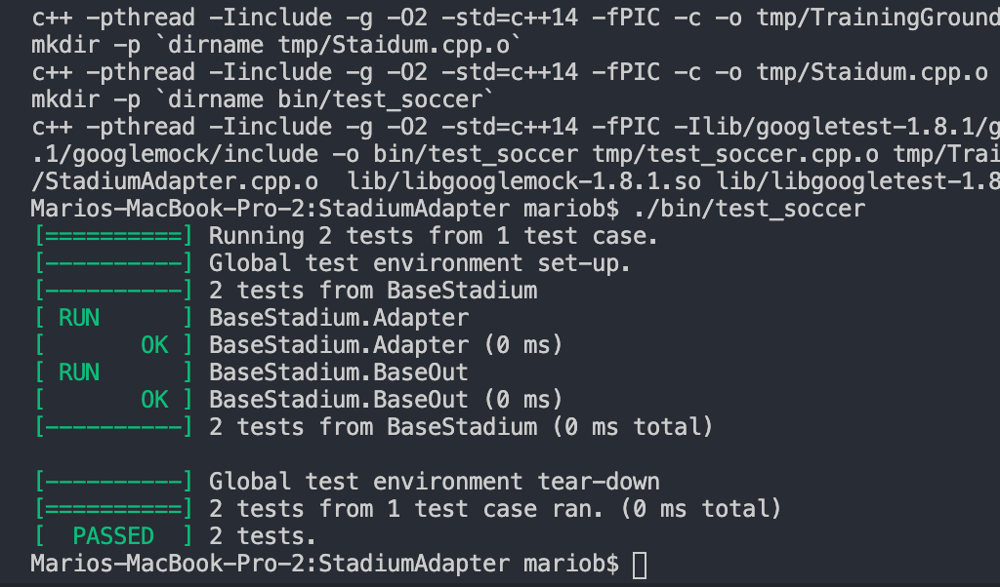

#### ```Tests inside of bin/test_soccer```
	- Files unders src/
	- /include/stadium.h trainingGround.h
	- src/test_soccer.cpp


## Passed Tests Capture



```

## References

1. [GNU make tutorial](https://linuxhint.com/gnu-make-tutorial/)
1. [C++ Google Test](https://github.com/google/googletest)
1. [Google Test Primer](https://www.learncpp.com/cpp-tutorial/89-class-code-and-header-files/)
1. [src/include](https://www.learncpp.com/cpp-tutorial/89-class-code-and-header-files/)


